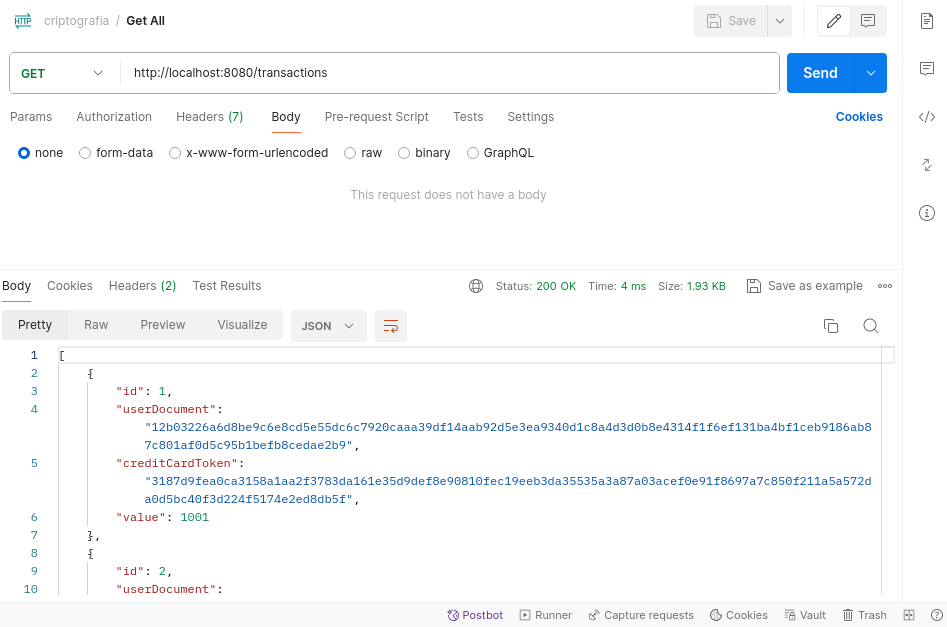

## Descrição

Este projeto e uma API RESTful que tem como foco garantir a proteção de campos sensíveis realizando a criptografia (hashing) dos mesmos em tempo de execução ao gravar e recuperar dados do banco de dados. Os campos userDocument e creditCardToken são criptografados utilizando o algoritmo de SHA-512 antes de serem salvos no banco.

## Tecnologias

* ANSI C como linguagem de programação
* SQLite como banco de dados
* OpenSSL para criptografia (SHA-512)
* Makefile para compilar o projeto

## Instalação

Certifique-se de que você tenha as bibliotecas necessárias instaladas, incluindo SQLite e OpenSSL. Em sistemas baseados em Debian, por exemplo, você pode usar:

```bash
sudo apt-get install libssl-dev sqlite3 libsqlite3-dev
```


## Compilação

Apos instalar as bibliotecas necessárias, você pode compilar o projeto utilizando o Makefile:

```bash
make
```

## Execução

Para executar o projeto, basta rodar o binário gerado:

```bash
./crypto-api
```

### Docker

Você também pode executar o projeto utilizando o Docker. Para isso, basta rodar o comando:

```bash
sudo docker build -t crypto-api .
```

E depois:

```bash
sudo docker run -p 8080:8080 crypto-api
```


## Collection do Postman

A collection do Postman está disponivel no arquivo 
[criptografia.postman_collection.json](criptografia.postman_collection.json).
Você pode importar este arquivo no Postman para testar a API.

## Metodos da API

### GET ALL
Retorna todas as transações
```bash
curl --location 'http://localhost:8080/transactions'
```

### GET
Retorna uma transação
```bash
curl --location 'http://localhost:8080/transactions/1'
```

### POST
Adiciona uma transação
```bash
curl --location 'http://localhost:8080/transactions' \
--header 'Content-Type: application/json' \
--data '{
    "userDocument": "1234567890",
    "creditCardToken": "1234 5679012 3456 ",
    "value": 1001.000000
}'
```

### PATCH
Atualiza uma transação
```bash
curl --location --request PATCH 'http://localhost:8080/transactions/1' \
--header 'Content-Type: application/json' \
--data '{
    "userDocument": "1234567890",
    "creditCardToken": "1234 5679012 3456 ",
    "value": 1001.000000
}'
```

### DELETE
Deleta uma transação
```bash
curl --location --request DELETE 'http://localhost:8080/transactions/1'
```


## Imagens

### GET ALL

